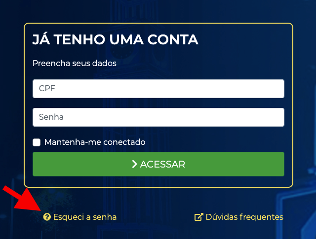

.. raw:: html

    <link rel="stylesheet" href="//code.jquery.com/ui/1.12.1/themes/base/jquery-ui.css">
    
    
    
    

.. Dúvidas frequentes da Conta PREFCG documentation master file, created by
   sphinx-quickstart on Wed Jul 21 14:11:41 2021.
   You can adapt this file completely to your liking, but it should at least
   contain the root `toctree` directive.

Dúvidas Frequentes da Conta PREFCG
==================================

A Conta PREGCG é uma única conta de credenciamento digital por usuário e senha que possibilita ao cidadão ter acesso a um conjunto de serviços digitais, disponibilizados pela Prefeitura de Campo Grande, em qualquer dispositivo eletrônico que permita a navegação pela internet (celulares, tablets, laptops e computadores).

Com uma conta criada no CONTA PREFCG o munícipe terá acesso rápido e seguro aos serviços oferecidos pela Prefeitura de Campo Grande. Desta forma, esta conta única facilita o acesso aos sistemas com a utilização de um só meio de autenticação e credenciamento, dispensando o uso de vários usuários e senhas para o acesso a cada sistema da prefeitura.

.. raw:: html
   
   

   <h3>Como recuperar minha senha do PREFCG?</h3>
   

.. toctree::
   :maxdepth: 1
   :caption: Como recuperar minha senha do PREFCG?
   

- Para recuperar sua senha, clique em “Esqueci minha senha”.

- Preencha o CPF e clique em “Enviar”. Instruções serão enviadas ao e-mail cadastrado (previamente).

- O e-mail enviado pela PMCG para a recuperação de senha, tem validade de uma hora. Após isso o procedimento deverá ser realizado novamente.

.. raw:: html

   

   <h3>Como criar uma conta PREFCG?</h3>
   

.. toctree::
   :maxdepth: 1
   :caption: Como criar uma conta PREFCG?

- Para criar sua conta, clique em “Criar Conta”.

- Preencha os dados solicitados, como: Nome, Sobrenome, E-mail, CPF e Senha e clique no botão verde “CRIAR CONTA”.
              

- Após clicar no botão “CRIAR CONTA”, o sistema enviará um e-mail para ativação da conta.

.. raw:: html

   

   <h3>Como validar a conta criada no PREFCG?</h3>
   

.. toctree::
   :maxdepth: 1
   :caption: Como validar a conta criada no PREFCG?

- Será enviado ao e-mail cadastrado, um link de confirmação. O envio do e-mail de confirmação é estimado em até 30 minutos.

- Atenção! Verifique as pastas de “Caixa de Entrada”, “Spam” e/ou “Lixo Eletrônico” e clique no link para validar a conta.

.. raw:: html

   

   <h3>Como acessar minha conta PREFCG?</h3>
   

.. toctree::
   :maxdepth: 1
   :caption: Como acessar minha conta PREFCG?

- Para acessar a conta, preencha os dados solicitados: CPF e Senha (previamente cadastrados e validados) e em seguida clique em “Acessar”.

.. figure:: _img/acessar_conta_1.png
   :align: center
   :alt:

.. raw:: html

   

   

